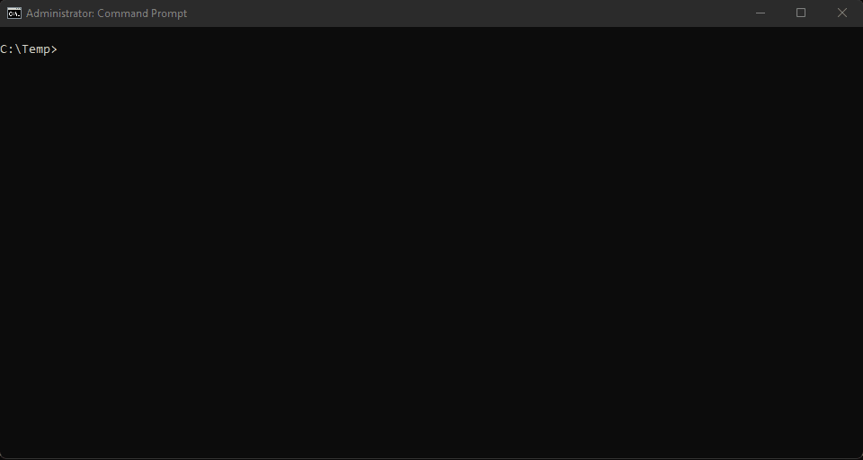

TSM - Terminal Service Manager
---

A console-based service manager for windows

why?
---

I'm in the console, I want something immediately, and I want background
and batch operations (start, stop, restart)

usage
---

Fire it up & start changing service state. Type to filter.

- `npm run build` to build
- `npm run publish` to build as a single file in the `Publish` folder
- `npm start` to quickly start up from within the repo

known issues
---
Status bar will render at the top of the screen (or appear hidden)
when the console is maximised. This appears to be an issue with
Terminal.Gui
